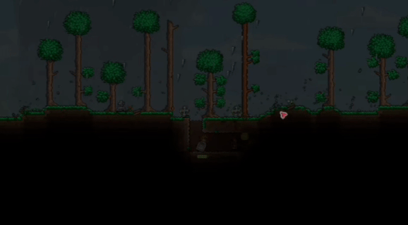
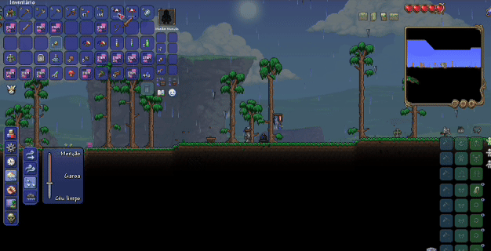

# O2 Thorn Rain 🌧️🌵

[](CHANGELOG.md)
[](https://terraria.org/)
[](https://github.com/tModLoader/tModLoader)
[](https://learn.microsoft.com/en-us/dotnet/csharp/)
[](https://github.com/olhocom2/O2-Thorn-Rain)

**O2 Thorn Rain** is a [Terraria](https://terraria.org/) mod built with [tModLoader](https://github.com/tModLoader/tModLoader) that turns ordinary rainy weather into an intense environmental challenge: sharp spikes fall relentlessly from the skies!

---

## 🎮 Gameplay & Protection Preview

<p align="center">
  
  
</p>

---

## 🎯 Features

- 🌧️ **Dynamic Thorn Rain:** Whenever it rains in your Terraria world, thorns rain down over exposed surface areas.
- 💨 **Wind-Influenced Physics:** Falling spikes dynamically drift based on the world's real-time wind speed (`Main.windSpeedCurrent`).
- 📈 **Progressive Hazard Damage:** Spike damage scales dynamically across world progression (Pre-Hardmode, Hardmode, Post-Plantera, Post-Golem, and Post-Moon Lord) and difficulty modes (Normal, Expert, Master).
- 🛡️ **Underground Exemption:** Deep caves, underground caverns, and submerged shelters remain safe—spikes only spawn in surface and sky zones (`ZoneOverworldHeight`, `ZoneSkyHeight`).
- ⚡ **Optimized Performance:**
  - Spawn cadence controlled via tick throttling.
  - Strict global active projectile cap (`MaxGlobalSpikes = 120`) and localized per-player caps (`MaxSpikesPerPlayer = 70`) preventing frame drops.
  - Solid collision validation before instantiating projectiles to prevent wasted entity allocations.
- 🌐 **Multiplayer Compatible:** Spawn logic, loot drops, and equipment sync are server-authoritative, ensuring smooth synchronized behavior without item duplication.

---

## ☂️ Protection & Survival Mechanics

Surviving the Thorn Rain requires preparation! Utilize vanilla tools and potions to brave the storm:

- ☂️ **Vanilla Umbrella Protection:**
  - Holding an open vanilla Umbrella (`ItemID.Umbrella`) protects you completely from falling spike damage.
  - **Exposure-Based Durability:** Features a dedicated durability meter (100% to 0%). Durability decays only when actively exposed to the storm with spikes threatening nearby (1 point lost every 0.5s of exposure).
  - **Visual Durability Bar & Tooltips:** Shows an in-game durability bar directly in your inventory slot and categorized states:
    - **Novo / New:** 100% – 50%
    - **Danificado / Damaged:** 49% – 15%
    - **Quase Quebrado / Almost Broken:** 14% – 1%
    - **Quebrado / Broken:** 0% (Protection disabled until repaired/replaced)
- 🧪 **Ironskin Potion Immunity (Priority 1):**
  - Drinking an Ironskin Potion (`BuffID.Ironskin`) provides **absolute immunity** to Thorn Rain damage while active.
  - While Ironskin is active, your equipped Umbrella suffers **no durability loss**.
- 💧 **Umbrella Slime Drop:**
  - Vanilla Umbrella Slimes (`NPCID.UmbrellaSlime`) now have a **5% chance** to drop the vanilla Umbrella upon defeat.

---

## 📂 Project Structure

```
O2ThornRain/
├── assets/
│   ├── thornRain.gif                # Hazard gameplay showcase animation
│   └── umbrella.gif                 # Umbrella protection & durability showcase animation
├── Common/
│   ├── GlobalItems/
│   │   └── UmbrellaGlobalItem.cs    # Umbrella durability, inventory bar, tooltips & network sync
│   ├── GlobalNPCs/
│   │   └── UmbrellaSlimeGlobalNPC.cs # Umbrella Slime loot table injection (5% drop)
│   ├── Players/
│   │   └── ThornRainPlayer.cs       # Player protection priorities, exposure tracking & durability decay
│   └── Systems/
│       └── SpikeRainSystem.cs       # World update hooks, wind physics, progressive damage & spawn regulation
├── Content/
│   └── Projectiles/
│       ├── SpikesProjectile.cs     # Spike projectile behavior, hit protection hook & lifetime
│       └── SpikesProjectile.png    # Sprite asset
├── Localization/
│   ├── en-US_Mods.O2ThornRain.hjson # English strings
│   └── pt-BR_Mods.O2ThornRain.hjson # Brazilian Portuguese strings
├── Properties/
│   └── launchSettings.json          # Debugging and launch configuration
├── build.txt                        # tModLoader mod metadata (version, author, name)
├── description.txt                  # In-game description
├── description_workshop.txt         # Steam Workshop description
├── icon.png                         # Mod icon (80x80)
├── icon_small.png                   # Small mod icon
├── O2ThornRain.csproj               # .NET project file
├── CHANGELOG.md                     # Semantic version history and release notes
├── CONTRIBUTING.md                  # Contribution guidelines
├── COMMIT_CONVENTION.md             # Conventional commit standards
└── README.md                        # Documentation
```


---

## 🚀 Installation

### Option 1: Steam Workshop (Recommended)
1. Subscribe to **O2 Thorn Rain** on the Steam Workshop.
2. Open **tModLoader**, go to **Manage Mods**, and enable **O2 Thorn Rain**.
3. Reload mods and enter your world!

### Option 2: Manual Installation from Source
1. Clone this repository into your tModLoader `ModSources` directory:
   - **Windows:** `%UserProfile%\Documents\My Games\Terraria\tModLoader\ModSources\O2ThornRain`
   - **macOS:** `~/Library/Application Support/Terraria/tModLoader/ModSources/O2ThornRain`
   - **Linux:** `~/.local/share/Terraria/tModLoader/ModSources/O2ThornRain`
2. Launch tModLoader.
3. Navigate to **Workshop** > **Develop Mods**.
4. Find **O2 Thorn Rain** and click **Build + Reload**.

---

## 🛠️ Development & Building

### Requirements
- [.NET SDK 8.0+](https://dotnet.microsoft.com/download)
- [tModLoader](https://store.steampowered.com/app/1281930/tModLoader/) v2023.11+
- An IDE with C# support: [Visual Studio](https://visualstudio.microsoft.com/), [Visual Studio Code](https://code.visualstudio.com/), or [JetBrains Rider](https://www.jetbrains.com/rider/)

### Building via Command Line
Run dotnet build pointing to the project:
```bash
dotnet build O2ThornRain.csproj
```

## 📝 Version History & Changelog

All notable changes and release milestones are tracked in detail in [CHANGELOG.md](CHANGELOG.md).

- **v0.2.0 (Latest):** The Protection Update — Vanilla Umbrella protection with exposure durability, inventory status bar, Ironskin Potion immunity, 5% Umbrella Slime drop, and progressive hazard damage scaling.
- **v0.1.0:** Initial Release — Environmental hazard spawner, wind-drift physics, and surface layer detection.

---

## 🤝 Contributing

Contributions, bug reports, and suggestions are welcome!
- Review [CONTRIBUTING.md](CONTRIBUTING.md) for local setup, workflows, and PR checklists.
- Follow our [COMMIT_CONVENTION.md](COMMIT_CONVENTION.md) to keep git history clear and structured.

---

## 📜 License & Credits

- Created and maintained by **[olhocom2](https://github.com/olhocom2)**.
- Developed for the Terraria community.
